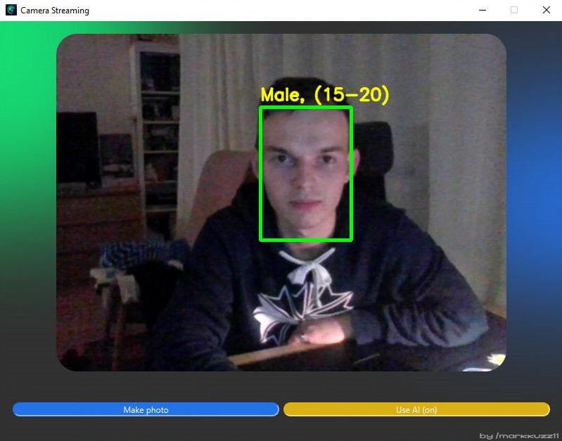

# CameraStreamingApp

## Desktop Camera Streaming Application


  

---------------------------

## Project Description

This project is a desktop application that streams video from a laptop camera with features such as capturing photos and detecting the gender and age of people in the frame.

The main libraries used in the project are **PyQt6** and **OpenCV**. PyQt6 is utilized for creating the user interface with additional image processing functions, while OpenCV handles the camera feed and performs gender and age detection of individuals in the frame.

In addition to running the program as a `.py` file, I’ve added the capability to run the application as an `.exe`. The `CameraStreamingApp.exe` file is located in the `dist` directory, created using the **PyInstaller** library.

Since a neural network is implemented for detection, certain models, weights, and configurations are required. These are stored in the `modelsAndWeights` directory and are utilized in the `maw.py` file. You’ll also need to configure the neural network (light settings, gender list, and age intervals) and load the models. These actions are also managed in `maw.py`.

---------------------------

## Installation

1. Download this repository to your device.
2. Install the required packages using the following command:

    ```bash
    pip install -r requirements.txt
    ```

---------------------------

## Running the Application

1. To run the application, execute the following command:

    ```bash
    python full.py
    ```
    The application will be ready to use after execution.

2. In addition to running the `.py` file, the app can also be launched as an `.exe`. The `CameraStreamingApp.exe` is located in the `dist` directory, created using PyInstaller.

3. If you need to modify any details in the `.spec` file, use the following command:

    ```bash
    pyinstaller CameraStreamingApp.spec
    ```
    If you want to rebuild the application, use the command below (important! If you change the media or modelsAndWeights directories, update the command parameters accordingly):
    
    ```bash
    pyinstaller --windowed --icon=media/logo2.ico --noconsole --name=CameraStreamingApp --onefile --add-data="media;media" --add-data="modelsAndWeights;modelsAndWeights" full.py
    ```

P.S. Photos taken with the app will be saved in your default Pictures folder under a new folder named `CameraStreamingApp`.

---------------------------

## Example of Application in Use


